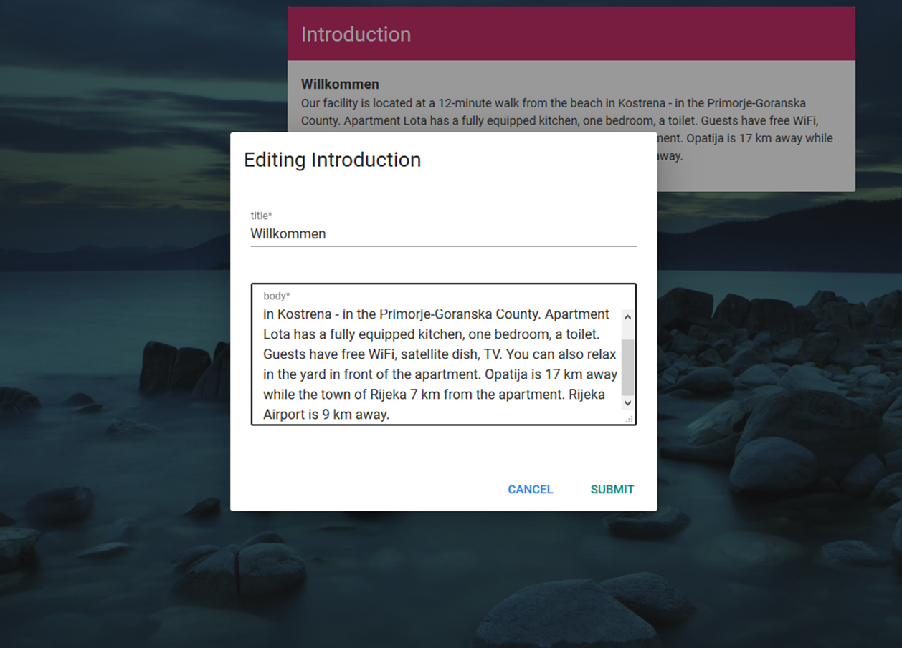
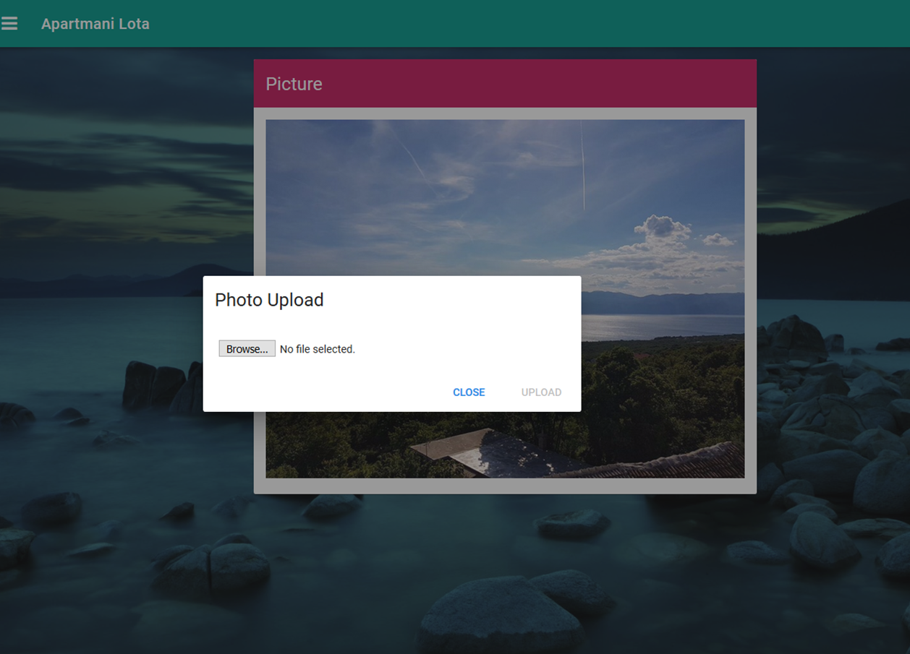
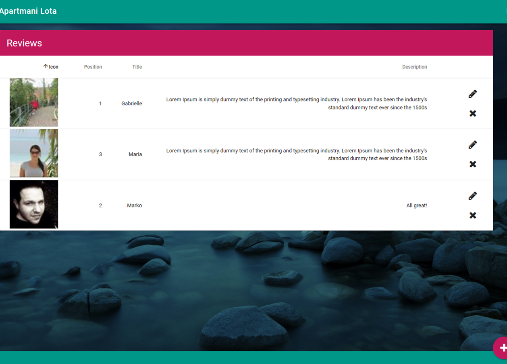
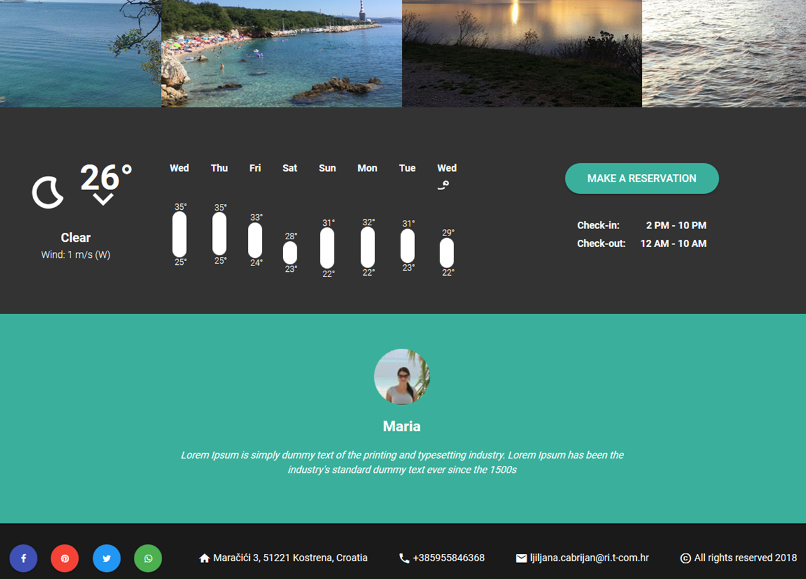
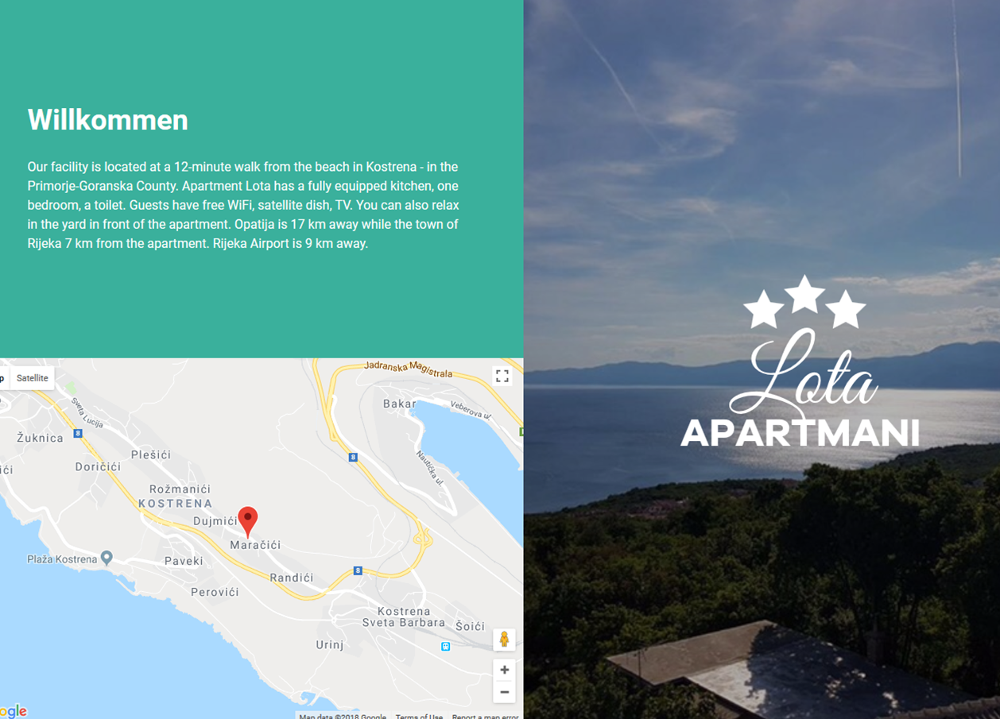

# Apartmani Lota

Apartment rent in Kostrena, Hrvatska. The client wanted a simple landing page. I decided to take it a step further and check out Vue. While i was at it, why not try Firebase as well. The page features a description of the place,services, a small gallery, social media bar, a weather broadcast and guest reviews. To make it an actual web app and to learn something more along the way i made a small admin panel where you can modify data on the page, upload and delete photos etc. I've basically turned a landing page into a crud project.

# Vue.js and Firebase

Having actual experience using AngularJS, **Vue** seemed very familiar as the underlying architecture is partially based off of angular's. The **Vue-CLI** made the initial setup very easy. The articles weren't lying about the gentle learning curve of the framework. It uses third party libraries where ever possible. Using **components** i realized how modular the code can be. The new approach really is a better foundation to build web apps upon. Furthermore, I've used **vue-router** to switch between views and a bunch of API's like google maps, weather and social media. Luckily, the vue community is vibrant and makes things much easier as you are one npm install away from getting what you need.

Firebase has an amazing API with a thorough documentation with examples of usage. I've done authentication, CRUD, and photo storage all using their service. It works like magic. At times it seems like things just work. It is definitely easier to use than the usual db systems.

## <i class="devicon-vuejs-plain"></i>

# Vuetify - A CSS Framework for Vue

Working with a css framework like Bootstrap is one thing, but Vuetify is made only for Vue and the elements are basically vue **components** with their **properties and directives** that you can use to customize them for your needs. The **flexbox-based layout** takes a bit of getting used to, but it has some really neat features like a ready side navbar you have right out of the box that fits the layout perfectly. Vuetify features modern elements based on googles popular **material design**. It contains almost everything you need for a crud app.

# CSS Grid

I've taken the opportunity to learn css grid along the way. I must say it is the best solution to building layouts. You can make your site responsive in just a few lines of code. The new **fraction** metrics are amazing. They have their own mechanics and timings. Flexbox is great, but it is one-dimensional while the grid considers a horizontal and a vertical plane at the same time. It is not to be used for simple tasks where flexbox is suitable. It is made to help you make an actual grid where you place elements into and it is best used that way.

