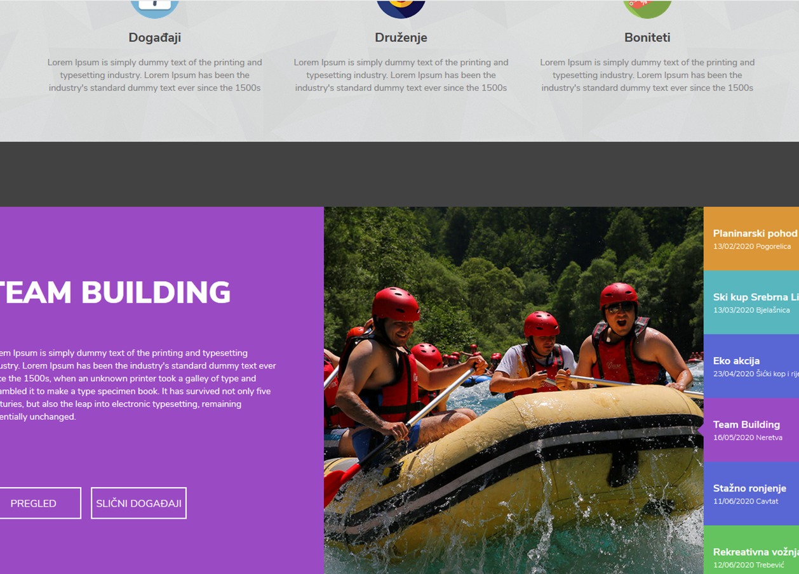
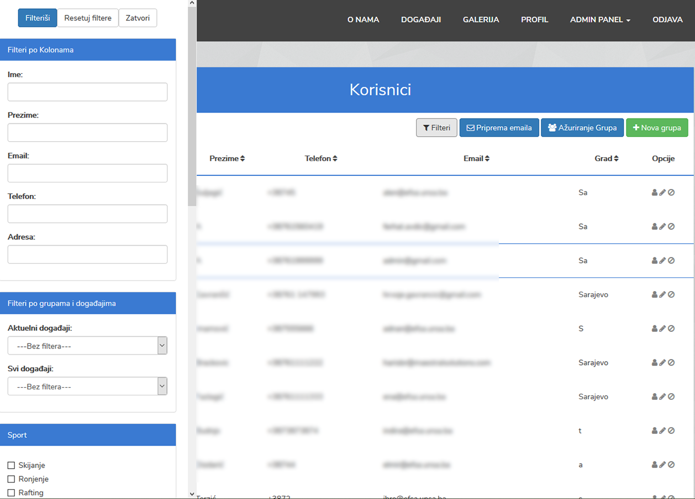
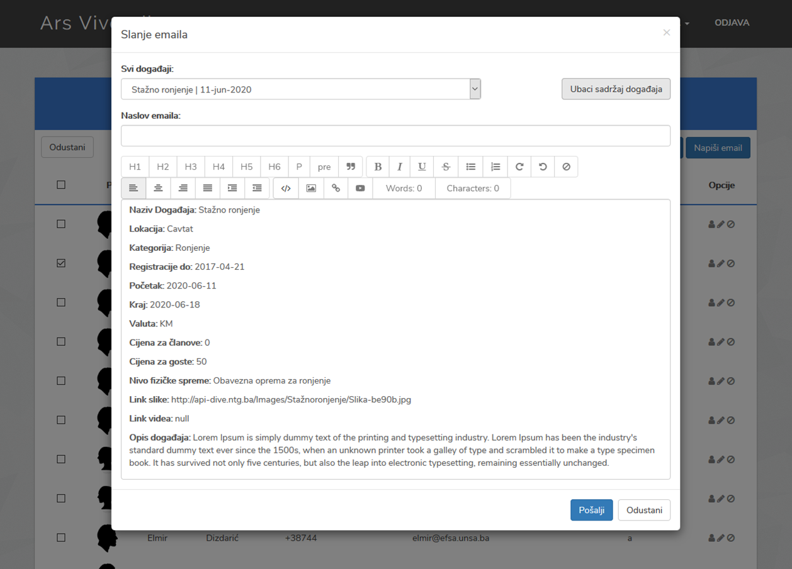
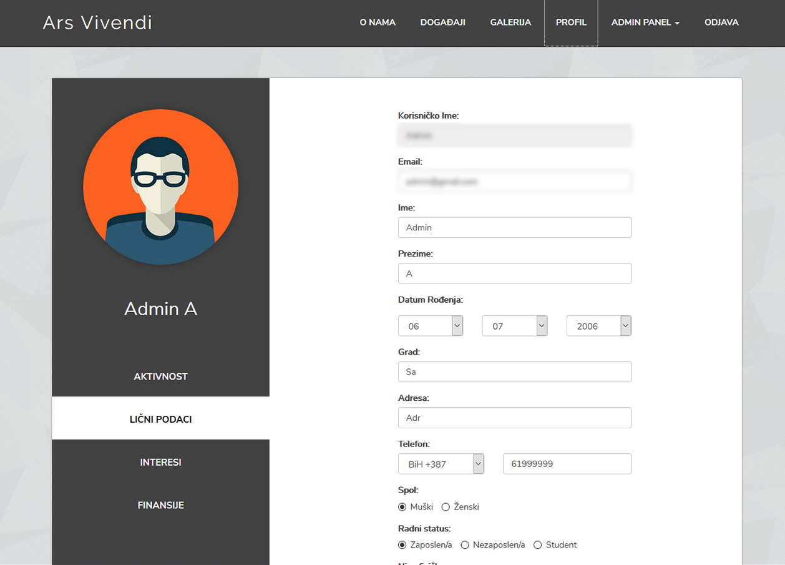
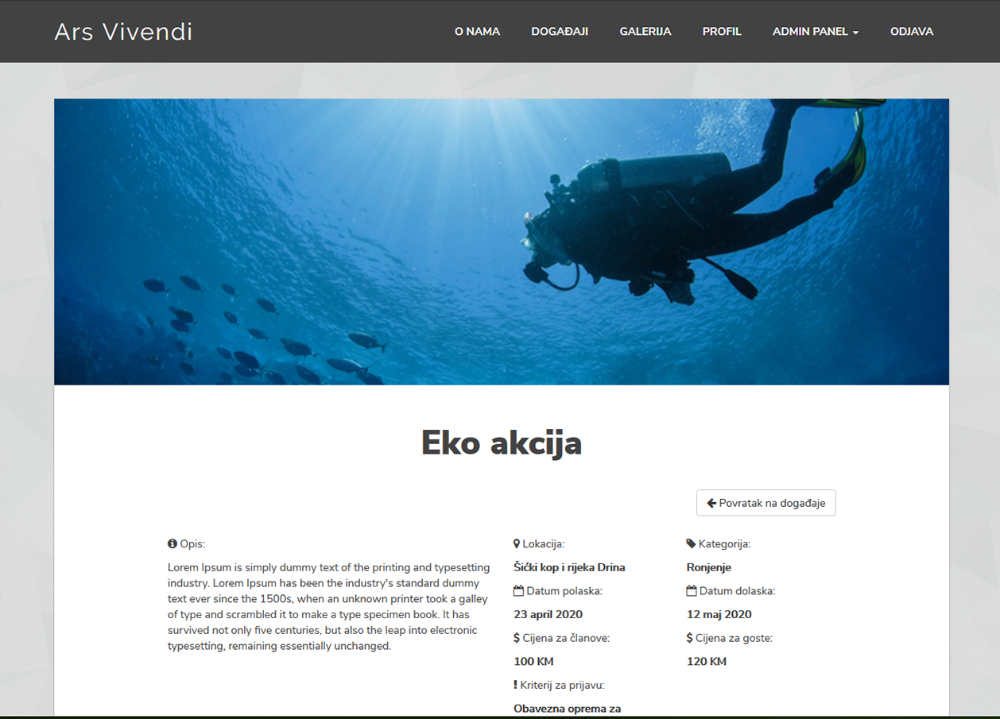

# Ars Vivendi

The web app for a community that would act as a platform to connect events and people. Everything was custom made from the landing page to the admin panel. The app includes event categories, events, profiles/users, user groups, send newsletter feature, user interests and characteristics,  event applications, transaction notes, a custom gallery,event comments and landing page CMS.

People basically register and search for events that match their interests. After applying they await approval and the admin can send them email notifications. The admin can manage all the above mentioned app features. It is all dynamic which made the app much harder to build.

# AngularJS + .Net Core

Straight out of practice at a local company, i was about to do some more work with angularJS. Knowing the basic directives and http requests i wanted to gain some more experience using the framework and i sure did. A collection of angular directives from **angular-ui-bootstrap** brought more confusion than utility into the project. I was struggling to understand the way it worked. At times there were just too many options i could chose from and ended up lost. In the end i managed to make use of the datepicker, dropdowns, pagination and other directives that helped me not reinvent the wheel. A colleague was working on the back-end side using .Net Core.

## <i class="devicon-angularjs-plain"></i> <i class="devicon-csharp-plain"></i>

# CSS - Reinventing the Wheel

Building my own css was a great practice on its own. I only watched some sites for inspiration and started coding my own classes to replicate what i've seen. This has improved my css skills and it showed me everything that was wrong with my code. I learned there are many best practices to be followed if you want the css to be scalable and managable in the long term.

