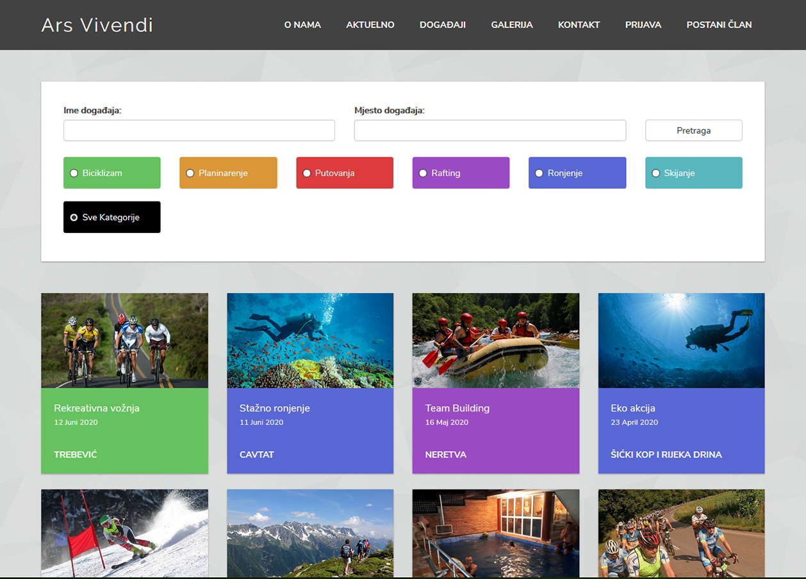

# Ars Vivendi

A Trip Advisor inspired university project. We had to build a simple crud app using mean stack, but since i was already long into it, i wanted to try out something new and build something meaningful. The idea was to use Gmaps API from within angularjs and explore how it all works. The app includes user signup, authentication, various crud modules like places to go, suggestions and reviews. To have things under control, i've built an admin panel to approve suggestions and manage places. The project was fun and exciting as i strived to write code as dry,clean and structured as i possibly can.

# AngularJS + .Net Core

Having javascript everywhere is so good its ridiculous. The code is same everywhere, only the things you work with change. From the **mongoDB** schemas to the **express** routes it all just connects so easily. **Angular's** out of the box solutions are great and work just the way you need them. The advantage of using javascript on both ends is that you don't need to reset your mind every time you go and work on the other end. Doing it all solo is easier this way.

## <i class="devicon-angularjs-plain"></i> <i class="devicon-csharp-plain"></i>

# Angular-ui-bootstrap

A css framework made entirely for AngularJS. Based on googles material design, the framework offers a very exhaustive list of angular directives you can utilize to quickly generate layouts and elements. Every directive is customizable to fit your needs. The grid system was a bit unpredictable as the newer flexbox approach has its own set of rules to be followed. Cards, floating buttons, moving input labels, menu toolbars - right out of the box.

# On reinventing the wheel

Since the app has users and authentication, it was only natural to secure the routes. **Passport.js** magically makes this happen via middleware. Whenever the secured route is being accessed by someone, passport performs a check on their credentials. I've also learned a bit about password encryption when i was using **bycript.js**.

I've used the **GMaps API** obviously to generate maps, but also for text input autocomplete. The maps must be used wisely as google's api has a limit you can reach if you simultaneously send 5 or more requests which happened when i loaded my list of places. This can be avoided by a small delay between requests in case the limit is reached and by repeating the request. The modules are not too hard to setup, one must only bear such details in mind.

