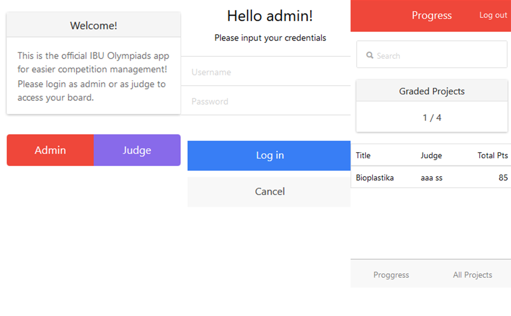
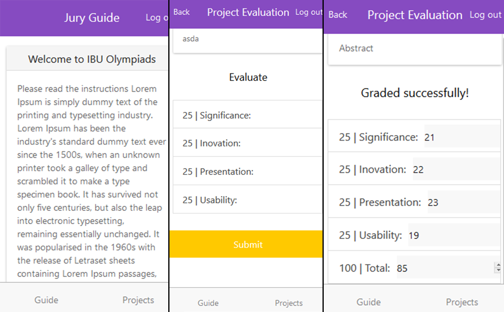
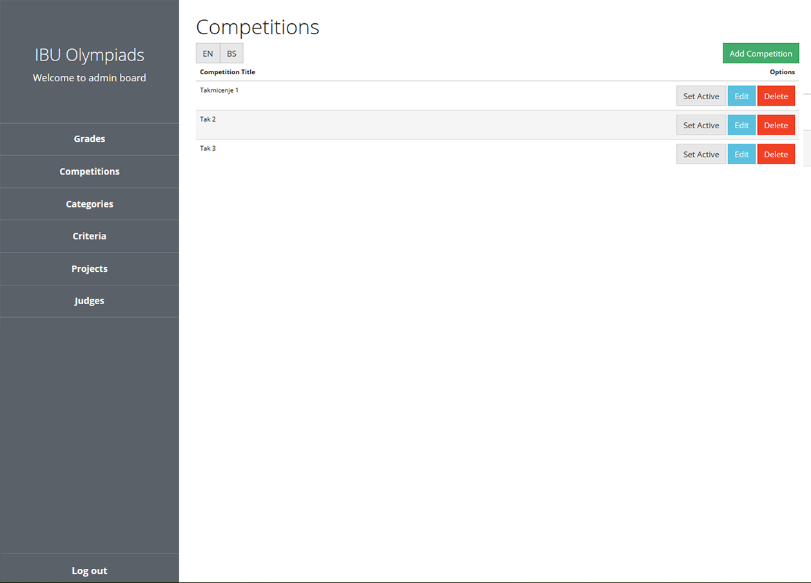
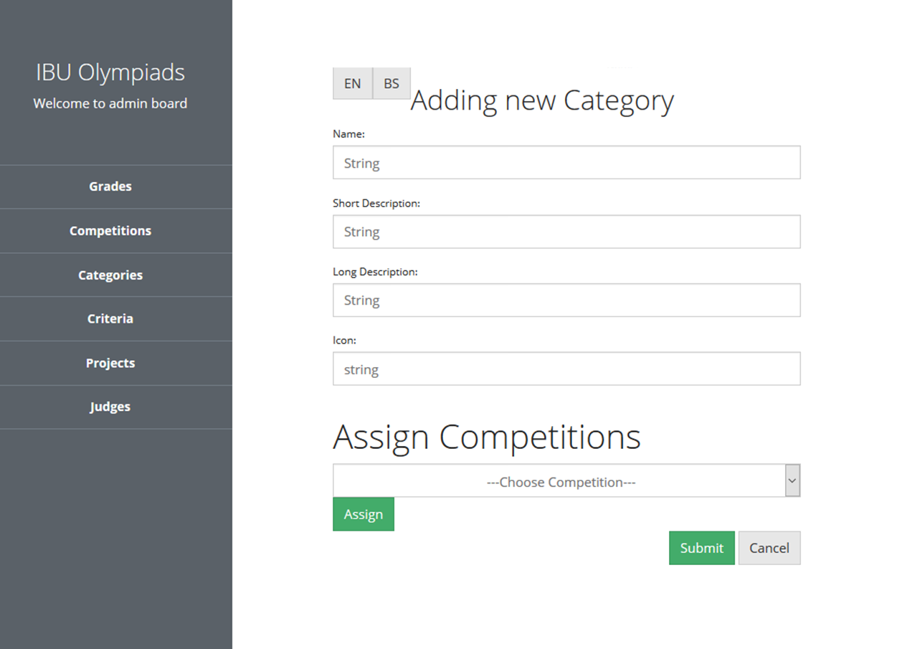
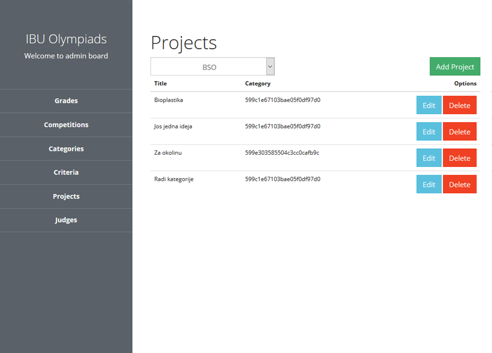

# Bosnian Science Olympiad
The graduation project that took my understanding of web apps to a higher level. The idea was to create two apps - a web and a mobile app to aid the competition management and judging. On top of that, there would be a landing page for students to register their projects. 

The web app covers the competition management entirely by assigning projects, categories, criteria and judges separately to each competition. You can literally change the entire landing page data in one button click. In a second you switch to a new competition instance with rules and data you have previously created. The administrator assigns project categories and tokens to the jury so they can login with a simple code which expires after the competition. The codes can be printed out from within the interface.

The jury uses the mobile app to read about and grade projects they were assigned. The grades appear in both the web and the mobile admin interface. The graduation project was done in hope to improve the overall quality of the science fair.

# MEAN Stack + Ionic
Expanding my skills with the back-end side was something i wanted to do since day one. Finally, after months of **AngularJS** i was able to move onto the other part of web apps as well and learn how it all works together. Luckily, the MEAN stack is a very convenient one using javascript on all ends. 

Thanks to the thorough docs of **mongoDB** and **express.js** i could build the whole app from ground up. From user authentication via **bcrypt.js** and **passport.js** to **json web tokens** which are persisted on the front-end for app routing security purposes. 

Having some previous experience with mongoDB i was able to create **schemas** via **mongoose** and build **aggregate queries** to fetch the exact data i need. Express.js **router** has let me create the api routes in no time and secure them by passport's middleware.

**Ionic** was a new framework back then made for AngularJS (1.x). It wasn't as developed as today and the directives weren't so well done, but it worked! I made a hybrid mobile app in just a couple of hours after i understood how the framework worked. It basically turned a web app into a mobile app. I was impressed and just thought of what i could do next with it. Today the possibilities are huge as the technology evolved as well.

## <i class="devicon-mongodb-plain"></i> <i class="devicon-express-original"></i> <i class="devicon-angularjs-plain"></i> <i class="devicon-nodejs-plain"></i>

# First time back-end - noSQL DB
Doing a project from one end to the other is something you must go through to really understand how a web app works. Im glad to have done it on time so i can grow as a web developer. Doing authentication was very important for me to see how it can work with json web tokens.

I learned that one has to think the db through for a project to work long term. Express and node are a beautiful and fast way to create web apis, the tricky part is in querying the database. I believe i understand the back-end developers a bit better after this project.

