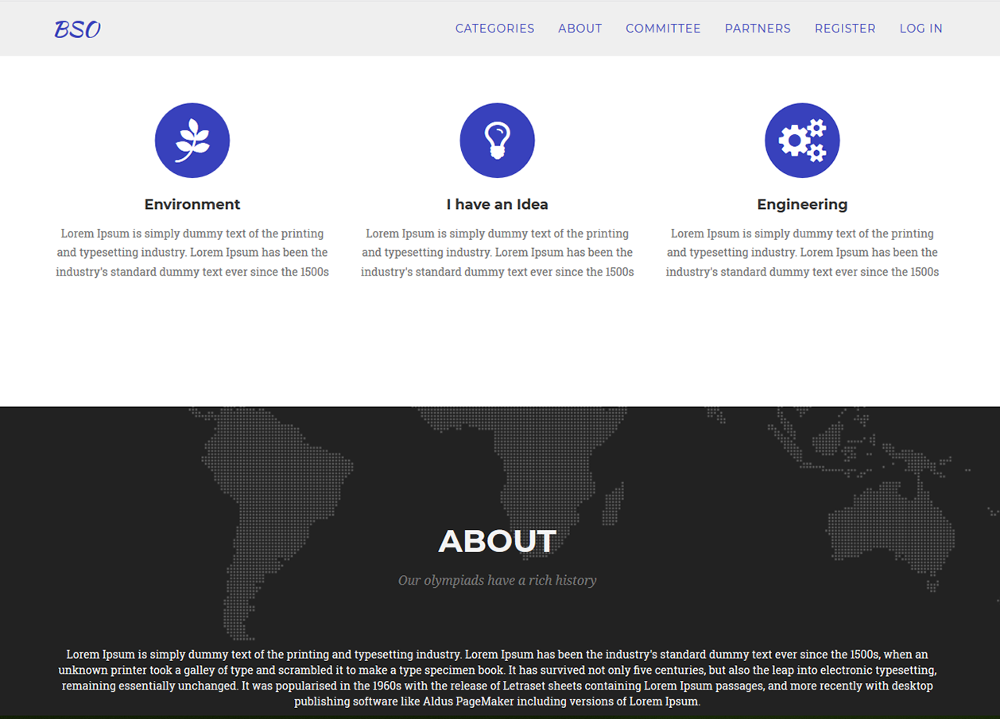
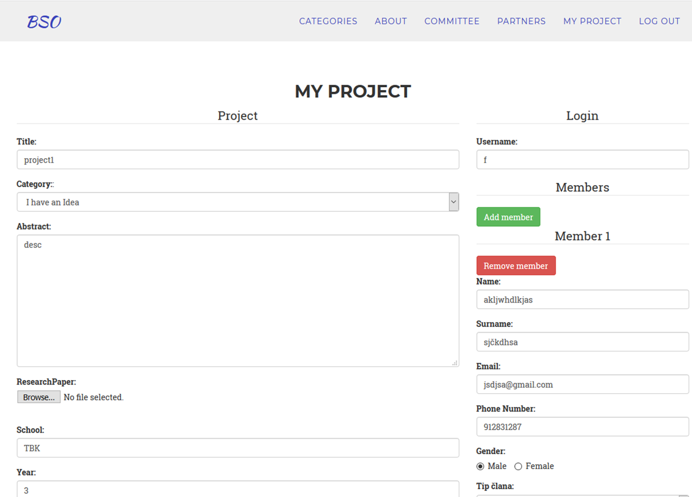

# Bosnian Science Olympiad

A Trip Advisor inspired university project. We had to build a simple crud app using mean stack, but since i was already long into it, i wanted to try out something new and build something meaningful. The idea was to use Gmaps API from within angularjs and explore how it all works. The app includes user signup, authentication, various crud modules like places to go, suggestions and reviews. To have things under control, i've built an admin panel to approve suggestions and manage places. The project was fun and exciting as i strived to write code as dry,clean and structured as i possibly can.

# MEAN Stack + Ionic

Having javascript everywhere is so good its ridiculous. The code is same everywhere, only the things you work with change. From the **mongoDB** schemas to the **express** routes it all just connects so easily. **Angular's** out of the box solutions are great and work just the way you need them. The advantage of using javascript on both ends is that you don't need to reset your mind every time you go and work on the other end. Doing it all solo is easier this way.

## <i class="devicon-mongodb-plain"></i> <i class="devicon-express-original"></i> <i class="devicon-angularjs-plain"></i> <i class="devicon-nodejs-plain"></i>

