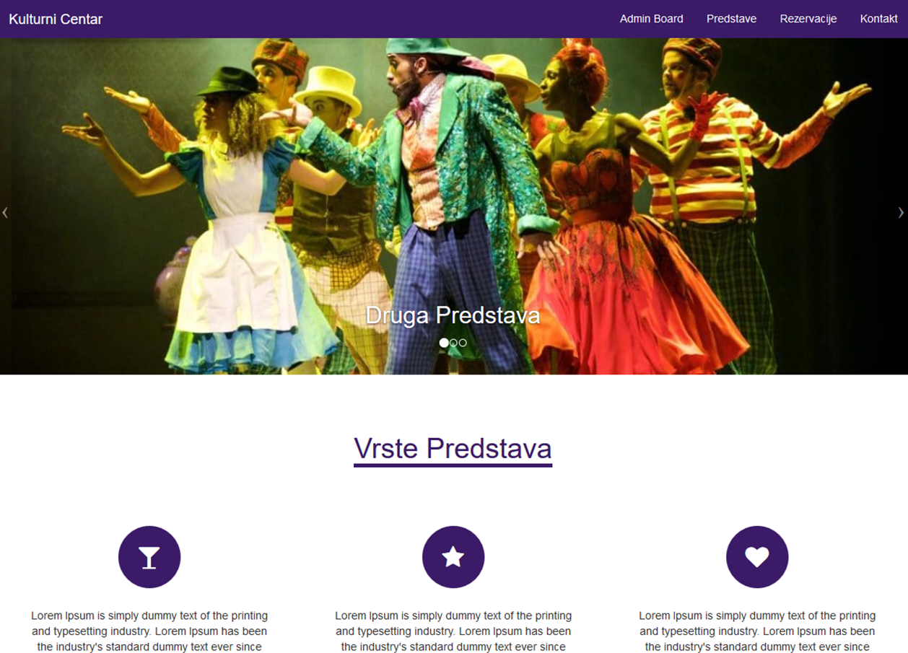
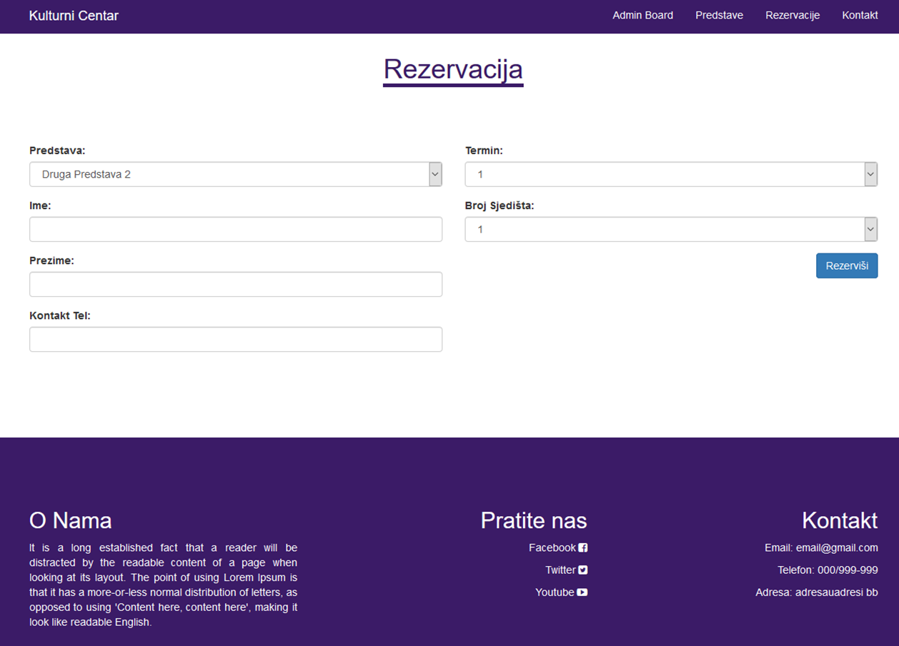
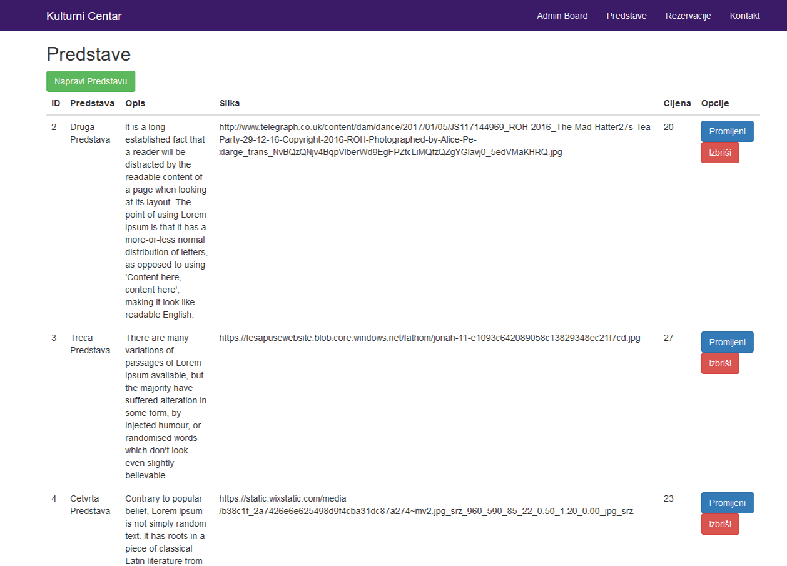

# Kulturni Centar

A university project where we were to use a PHP framework to build a basic crud app. This is rather a web app mock. I've chosen Code Igniter for the sake of simplicity. You can create shows, reserve places, and contact the place. It is all done in a crud fashion just to check out this framework and how it works. 

# Code Igniter

The coding pattern is strictly **MVC** which makes you to write cleaner code. I really loved how Code Igniter approaches the front and back-end and how it handles requests. Coming from Angular, i didn't realize there were full stack frameworks before. The docs were not so thorough but still useful with some additional google searches. I grew with the style pretty quickly and i must be honest - i didn't see why one would hate PHP here at all. Everything seemed pretty clean and worked just great. If anything, php got my attention after using the framework.

##  <i class="devicon-codeigniter-plain-wordmark"></i>

