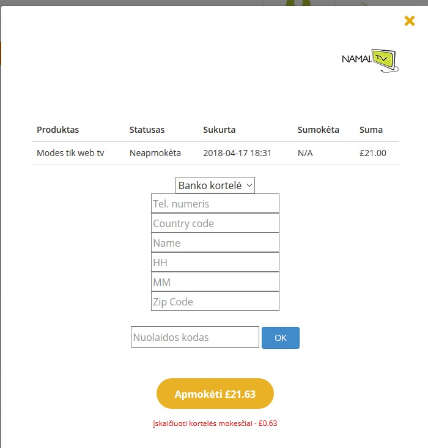

# Namai TV

> "Television without device"

A TV service that streams channels online that can be accessed from anywhere. I was assigned a task to refactor the service order form. It is a basic task, but given the circumstances, i had to get into a framework im unfamiliar with and do the back-end part as well. To make things even more uncomfortable, i had to use SSH and VIM to code directly on the server. One could expect what could happen when a team of people works without version control. So i took measures to ensure the code doesn't get lost. 

The form was supposed to send an email instead of making an api call to a payment service while still saving the records in the database.

# AngularJS + Symfony

Coping with unclean, unstructured code can be a pain. While the front-end part was still easy to do, the **PHP framework** on the back-end side was new to me so i had to figure out how everything is connected. I've seen different file formats like **YAML** or **TWIG templates**. I'm glad i worked with php here. Something different this time.

## <i class="devicon-angularjs-plain"></i>  <i class="devicon-symfony-original"></i>

# SSH and VIM

This is where it got interesting. The server i was given to work with had some compatibility issues between operating systems when code is pushed to the repository or pulled from it. The client gave me access to their server via SSH to code from within their system. Vim may be powerful, but nowadays, its really easier to work from within GUI, at least for me. I didn't want to waste time on vim plugins for such a small task so everything was manual.

##  <i class="devicon-ssh-plain-wordmark"></i> <i class="devicon-vim-plain"></i>

