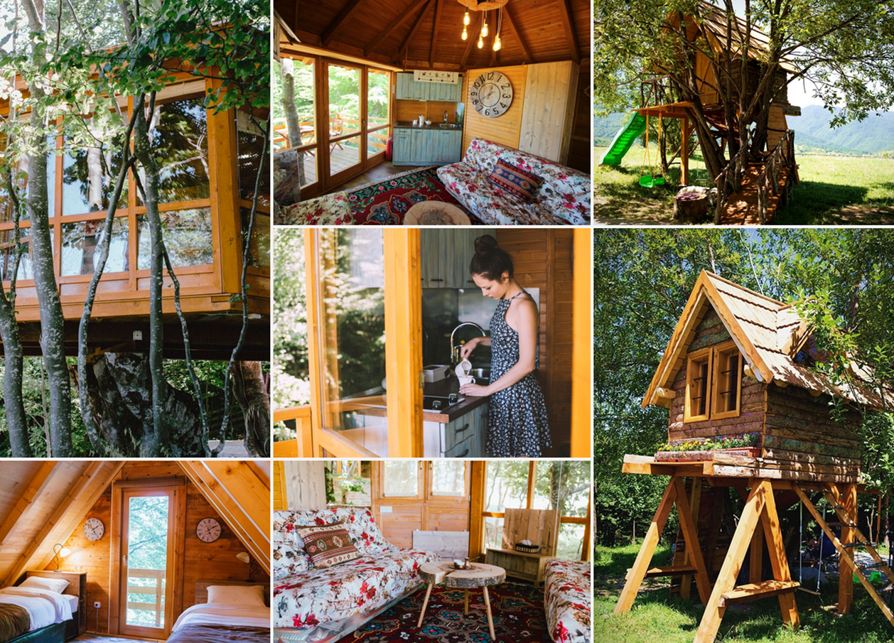
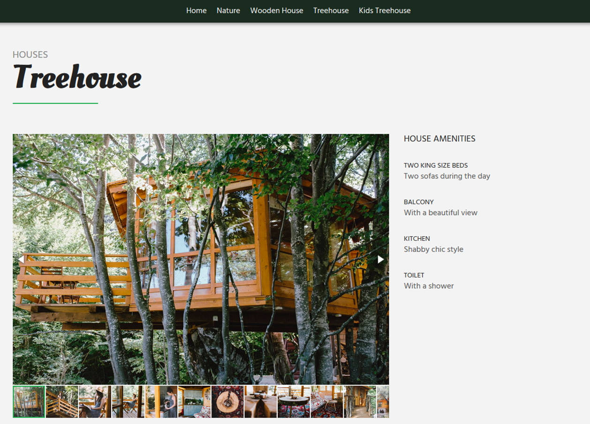
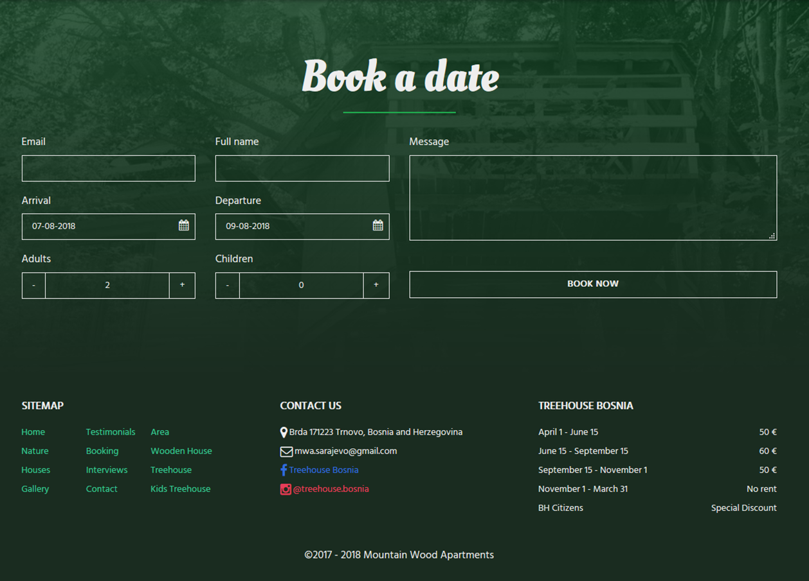

# Treehouse Bosnia

Treehouse apartments rent at Treskavica near Trnovo. Such a beautiful, unique place deserves a responsive landing page that's just as attractive. Images played a vital role in representing an atmosphere not found anywhere else. The site needed dedicated gallery pages to show relevant pictures along some basic description of the facilities. Built as a site for booking, it includes an email form to let the visitors book dates instead of using a third party like booking.com.

# Nodemailer + Mailgun

A basic **Node.js** server followed by an smtp service by **Mailgun** allowed me to quickly create an api for sending emails using nodemailer. The route endpoint is created via **Express.js** which is accessed by using the new **Fetch API** in common javascript. The front-end is completely static to ensure speed.

## <i class="devicon-nodejs-plain ml-auto"></i> <i class="devicon-express-original"></i> <i class="devicon-bootstrap-plain"></i>

# Layout and CSS Practice

Having focused mostly on the front-end frameworks lately, i didn't pay enough attention to information architecture. This time i was building a static site to do most of the work in the design department. Putting all the pieces together in a meaningful manner is indeed a craft on its own. The modern mobile-first single landing pages have a layout that tells a story. It needs to quickly draw attention and reveal only bits of information to keep the viewer interested.

Besides the hard-thinking part, i've endorsed practicing some css tricks such as **masonry** in the layout. The advantage of doing it in a **flexbox** fashion is that the positions don't get messed up as the images load. Something that was done using javascript before is now possible by just defining a few classes in css. Another step forward for me was in the usage of ::before and ::after **pseudo classes** which helped me create a smooth transition from the email form into the footer of the site. The cool css **filter** effects allowed for some cool photoshop-like image adjustments like blur and grayscale to complete the design.

Transitioning from transparent into colored, the **menu** itself gives a positive feel. The mobile version allows for a full-height toggle menu which is amazing. The transition is oddly satisfying. 

