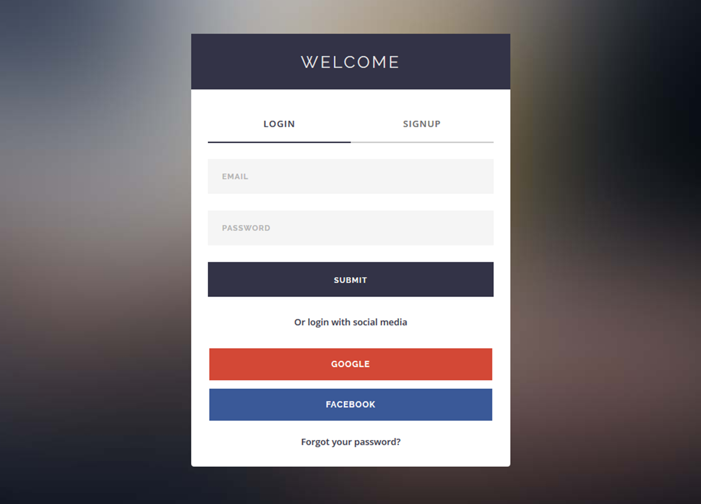
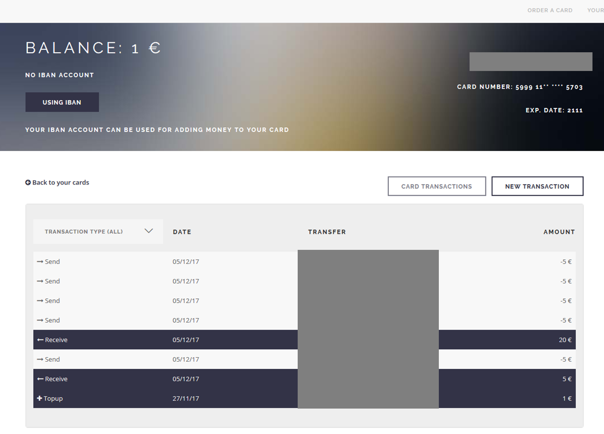
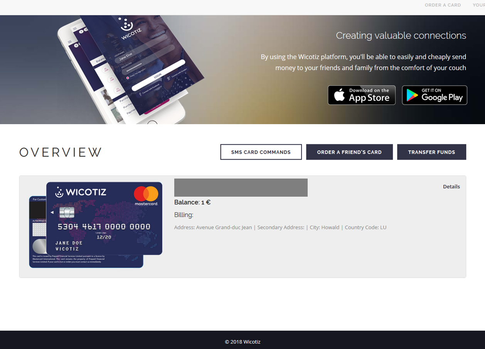

# Wicotiz Web App

> "Wicotiz card is a Mastercard® prepaid card with no bank account, available for everyone. Receive and send money, pay bills, shop online or in stores. It's a simple, secure and rechargeable payment method."

The client needed a web app to serve the purpose of the wicotiz card. You basically order a card, make the initial fund transaction and you can start using it. You can order a card for a friend/family as well and send money to their card. Its a nice transaction service.

The approach to this project is something im really proud of. Writing modular, clean and structured code is very helpful and makes things faster in the long term. The app included some things i loved to explore such as integrating locales, facebook and google authentication api, working with payment integration etc. These are a good addition to my knowledge as they come up very often.

# AngularJS

As the app grows, angular starts to show its true glory. Having everything organized in a clean file structure that tells you exactly where what belongs (i.e. everything has its right place and name) and having dependency injection is something you never want to go back from. I've built crud apps before with the framework that didn't require lots of api calls, services, filters and other dependencies. Now i truly understand the power of a well established framework. Google has done a great job and im looking forward to learning the new version.

The back-end was done by a colleague who did a wonderful job making my journey painless.

## <i class="devicon-mongodb-plain"></i> <i class="devicon-express-original"></i> <i class="devicon-angularjs-plain"></i> <i class="devicon-nodejs-plain"></i>

# Combining design and front-end work

My first journey on upwork had to be done correctly. I gave it my all to build something pleasing and useful. I was given a template that helped me shape the design that would stay true to the one in the landing page and mobile app. I had to modify it multiple times to have it compatible with angular and fit my needs as it was built upon jquery. 

Playing with **facebook and google authentication api** together with angulars promise-like **$q** object ended surprisingly well. The **angular-translate** integration, however, was just a boring task although i learned something new. The issue was that we decided to do it later along the line rather than doing it in the very beginning. The usual api calls were something i was already very familiar with so it was only mechanical. A **good communication between team members** makes this part easier. As long as both sides can agree on the architecture there are no issues. The **payment integration** was done mostly on the back-end, however there are some service calls on the front as well.

I'm very happy i got the opportunity to work on this project together with a decent back-end developer.

